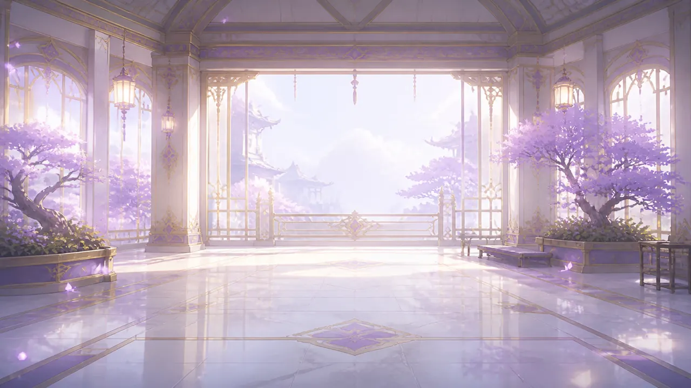
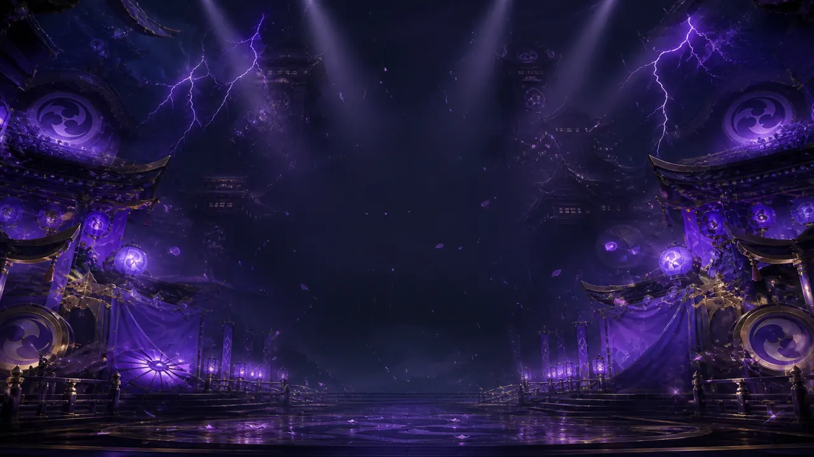

# Raiden Inazuma Atelier / 稻妻雷电工房

[](https://github.com/lengzhanbao/dsh-raiden-theme/actions/workflows/ci.yml)

紫金亚克力 **DSH Web 主题** — 浅色天守花房 / 深色雷舞台、紫金对话框、雷电将军立绘与 Q 版侧栏。架构基于 Taffy Live Atelier，**独立仓库、独立包名**，未混用塔菲角色图。

| | |
| --- | --- |
| Package | `@dsh-external/dsh-raiden-theme` |
| Version | `0.1.0` |
| Platform | DSH **Web** profile only |
| Requires | DeepSeek Harness `0.1.0-rc.6`+ |

## 下载即用

```bash
dsh plugin --profile web add https://github.com/lengzhanbao/dsh-raiden-theme/releases/latest/download/dsh-external-dsh-raiden-theme-0.1.0.tgz
dsh web
```

然后：**设置 → 通用 → 雷电模式** 打开总开关，浏览器 **硬刷新**（Ctrl+F5）。

| 文档 | 说明 |
| --- | --- |
| [安装指南（中文）](docs/install.zh.md) | 环境要求、自检清单 |
| [Install guide (EN)](docs/install.en.md) | Same for English |
| [使用说明](docs/usage.zh.md) | 透明度、预设、素材声明 |
| [CHANGELOG](CHANGELOG.md) | 版本变更 |

## 截图

| 浅色 Light | 深色 Dark |
| --- | --- |
|  |  |

## 简介

**Raiden Inazuma Atelier** 为 [DeepSeek Harness](https://github.com/deepseek-ai/deepseek-harness) Web 提供稻妻风界面：花房/夜舞台壁纸、紫金对话框、左右立绘、Q 版按钮。资源本地打包；**只改外观**。

- 壳层架构参考 [Taffy Live Atelier](https://github.com/lengzhanbao/dsh-taffy-theme) 与 [maid-atelier](https://github.com/Small-tailqwq/dsh-deep-whale/tree/main/maid-atelier)，**未复制**其角色资产
- 角色为原神雷电将军**非官方同人** fan skin，见 [NOTICE.md](NOTICE.md)

## 卸载

```bash
dsh plugin --profile web remove @dsh-external/dsh-raiden-theme
```

## 开发者

```powershell
npm run install:dev
dsh web
```

详见 [environment-baseline.md](docs/environment-baseline.md)。切勿手改 `profiles/web/package.json`。

## 素材与授权

- **源代码**：[MIT](LICENSE)
- **角色图像**：非官方同人；详见 [NOTICE.md](NOTICE.md)
