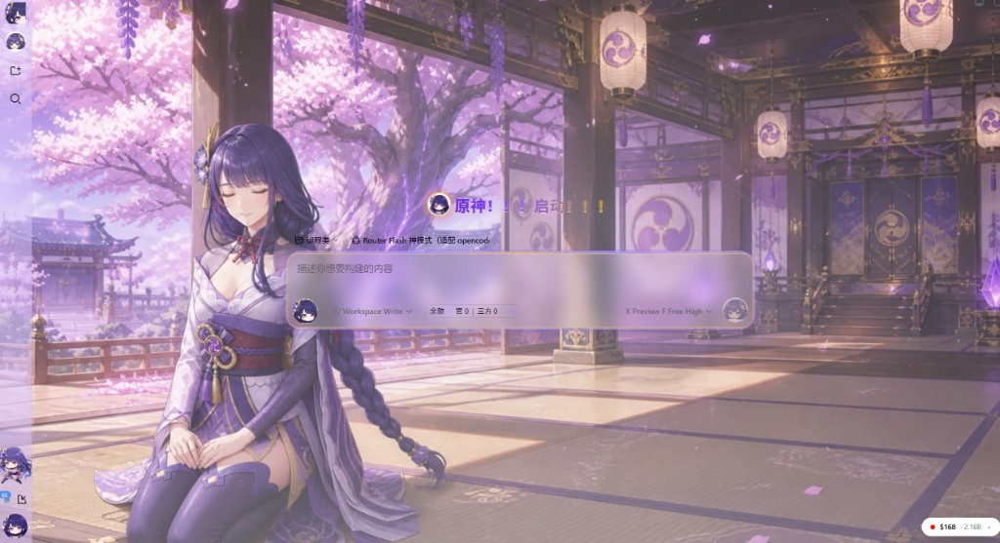
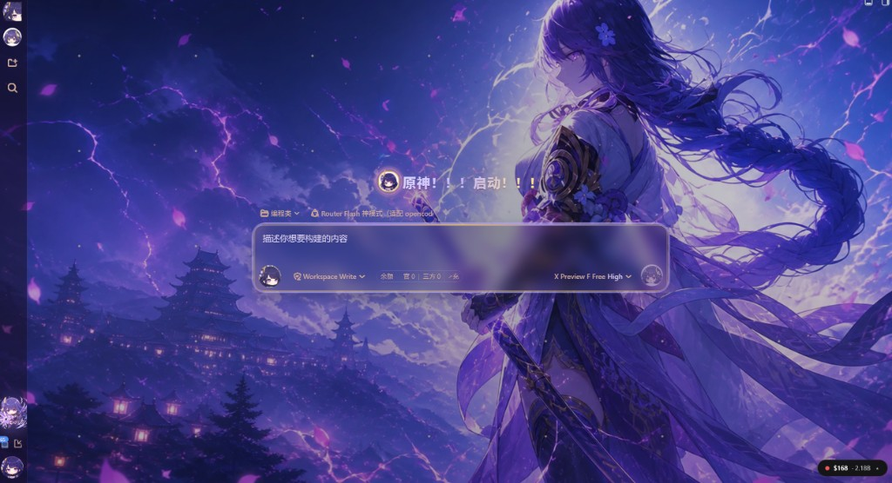

# Raiden Inazuma Atelier / 稻妻雷电工房

[](https://github.com/lengzhanbao/dsh-raiden-theme/actions/workflows/ci.yml)

为 [DeepSeek Harness](https://github.com/deepseek-ai/deepseek-harness) **Web** 打造的雷电将军同人主题：紫金亚克力对话舞台、稻妻风全屏壁纸、Q 版侧栏动图与可选 Agent 预设。只改外观，不碰会话与模型逻辑。

| | |
| --- | --- |
| Package | `@dsh-external/dsh-raiden-theme` |
| Version | `0.1.0` |
| Platform | DSH **Web** profile only |
| Requires | DeepSeek Harness `0.1.0-rc.6`+ |

## 截图

| 浅色 · 天守花房 | 深色 · 雷舞台 |
| --- | --- |
|  |  |

上图分别为浅色与深色外观下的实际界面：全屏稻妻风壁纸（立绘已融入场景）、紫金对话框、侧栏 Q 版动图与「原神！！！启动！！！」标题。

## 下载即用

```bash
dsh plugin --profile web add https://github.com/lengzhanbao/dsh-raiden-theme/releases/latest/download/dsh-external-dsh-raiden-theme-0.1.0.tgz
dsh web
```

然后：**设置 → 通用 → 雷电将军工房** 打开总开关，浏览器 **硬刷新**（Ctrl+F5）。

| 文档 | 说明 |
| --- | --- |
| [安装指南（中文）](docs/install.zh.md) | 环境要求、自检清单 |
| [Install guide (EN)](docs/install.en.md) | Same for English |
| [使用说明](docs/usage.zh.md) | 透明度、预设、素材声明 |
| [CHANGELOG](CHANGELOG.md) | 版本变更 |

## 功能一览

### 视觉与舞台

- **双模式壁纸**：跟随 DSH 全局「外观」自动切换  
  - **浅色**：樱花花房、紫藤、暖色日光，将军端坐于左侧  
  - **深色**：天守阁雷暴、紫电、浮樱瓣，将军侧身持薙刀于右侧  
- **融合立绘（fused scene）**：角色已烘焙进壁纸，避免重复叠图；可在设置中单独开关左右立绘层（默认跟随融合场景隐藏独立图层）
- **紫金亚克力对话框**：粉紫外框 + 金边内框，半透明磨砂面板，对话区与输入框统一稻妻配色
- **环境粒子**：浅色飘樱瓣、深色电光微粒；可在「减弱动效」下关闭
- **主标题文案**：首页大标题替换为 **「原神！！！启动！！！」**（卸载主题后自动还原）

### 侧栏与图标

- **品牌头像**：侧栏底部放大版 Q 版雷电将军头像
- **Q 版功能图标**：新建会话、发送、设置、命令芯片等节点替换为统一 Q 版风格图标
- **工作区 Q 版动图**：挂载在侧栏 **工作区** 区域右下角（位于「已归档」上方），约 148×148px  
  - 6 帧慢速拳击/闪电循环动画（无损 WebP）  
  - 浅色/深色各一套，边缘按主题色去黑边、仅外轮廓保留抗锯齿透明  
  - 支持 `prefers-reduced-motion` 与设置内「减弱动效」→ 自动切换静帧  
  - 可在 **雷电将军工房 → 工作区 Q 版动图** 单独开关

### 设置面板（设置 → 通用 → 雷电将军工房）

| 分组 | 选项 | 说明 |
| --- | --- | --- |
| 总开关 | 开启 / 关闭 | 关闭后移除全部皮肤装饰 |
| 透明度 | 边框 / 面板 / 背景纱 / 亚克力 | 0–100%，即时生效，存于浏览器 localStorage |
| 立绘 | 左侧 / 右侧 | 独立开关（融合壁纸模式下通常无需开启） |
| 立绘透明度 | 滑块 | 控制立绘层不透明度 |
| 工作区 Q 版动图 | 开启 / 关闭 | 控制侧栏工作区 mascot |
| 减弱动效 | 开启 / 关闭 | 关闭循环光晕、呼吸、粒子与动图 |

### 可选 Agent 预设

在 **Agent 预设** 中选择 **「Raiden 雷电将军」** 可启用沉稳简洁的稻妻式口吻。  
**皮肤与说话方式相互独立**：关皮肤不影响 preset；开皮肤不自动改口吻。

预设源文件：`presets/raiden/agent.cordis.yml`

### 工程质量

- 资产门控：`npm run verify:assets` 校验壁纸/立绘尺寸、抠图质量、版本号
- 92 项单元测试 + 静态校验 + 打包校验
- 资源本地打包，经 DSH 资产路由 `/raiden-theme/assets/` 提供
- 架构参考 [Taffy Live Atelier](https://github.com/lengzhanbao/dsh-taffy-theme) 与 [maid-atelier](https://github.com/Small-tailqwq/dsh-deep-whale/tree/main/maid-atelier)，**独立仓库、独立包名，未混用塔菲角色图**

## 简介

**Raiden Inazuma Atelier**（稻妻雷电工房）是面向 DSH Web 的纯 UI 主题插件：

- 紫金配色 token、对话舞台 chrome、侧栏装饰均由客户端注入
- 角色素材为原神雷电将军**非官方同人** fan skin，详见 [NOTICE.md](NOTICE.md)
- 默认 **关闭**（`enabled: false`），需在设置中手动开启

## 卸载

```bash
dsh plugin --profile web remove @dsh-external/dsh-raiden-theme
```

## 开发者

```powershell
npm run install:dev
dsh web
```

本地改代码后：

```powershell
npm run build
npm test
```

工作区动图资产可用 `python scripts/defringe-workspace-mascot.py` 重新生成。详见 [environment-baseline.md](docs/environment-baseline.md)。切勿手改 `profiles/web/package.json`。

## 素材与授权

| 内容 | 许可 |
| --- | --- |
| 插件源代码 | [MIT](LICENSE) |
| 壁纸、立绘、Q 版图标与动图 | 非官方同人；仅供本主题 UI 展示，请勿单独提取或商用 |
